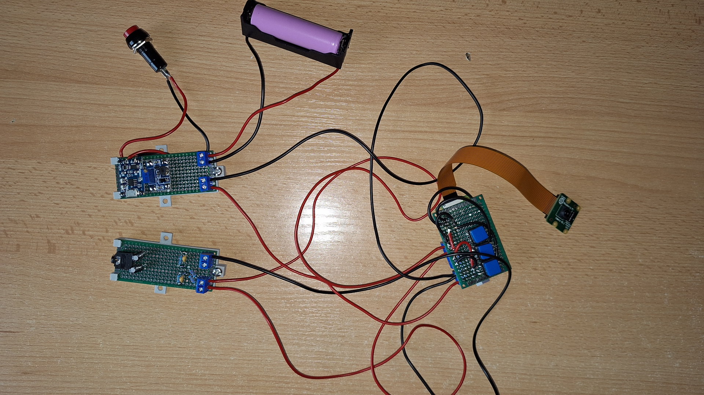

# piVA
Raspberry Pi powered Vision Assistant

---

This project was aimed to be a little bit different, my intention was to create 
minimum viable product (`MVP`) but considering lack of time and errors at hardware
planning phase it turned to be more like proof of concept (`POC`).
Despite this, the goal of building this device with the parts I had on hand has been achieved.

Anyway, here is the device that can help blind people perform everyday activities.

### Features
 
- Integration with speech synthesizer (in this case espeak).
- Audio jack for headphones connection.
- Objects detection.
- OCR.
- Standalone power source + usb-c charging.
- Buttons for easier controls.
- Turn on/off switch.

### POC Missing Features

- Battery level monitoring.
- 3D printed case, that makes device mobile.

### Usage

2 bottom buttons are for navigation between available modules.
Top one is for executing currently selected module.
Every step (current module change, module executing) is described by speech synthesizer.

### Parts


| Part Name                   | Quantity |
|-----------------------------|:--------:|
| RaspberryPi Zero 2          |    1     |
| prototype circuit board     |    2     |
| sd card                     |    1     |
| RaspberryPi Camera v2       |    1     |
| 5mm ARK connector           |    7     |
| TP4056 LiPol charger        |    1     |
| step up converter (2A)      |    1     |
| on/off switch               |    2     |
| LiPol bracket               |    1     |
| RPi GPIO Header             |    1     |
| 20 pin female connector     |    2     |
| button                      |    3     |
| jack connector              |    1     |
| 270 Ω resistor              |    2     |
| 150 Ω resistor              |    2     |
| 10nF electrolytic capacitor |    2     |
| 10nF polyester capacitor    |    2     |

### Assemble


Audio output circuit (I skipped protection diodes)

(source: https://learn.adafruit.com/adding-basic-audio-ouput-to-raspberry-pi-zero)

### Software

1. flash RPi with raspbian, setup `ssh` and `connectivity`
2. add/modify following lines to `/boot/config.txt`:

For audio output
```
dtoverlay=audremap,pins_12_13
disable_audio_dither=1
```

For camera
```
# Automatically load overlays for detected cameras
#start_x=1
dtoverlay=imx219
```

3. increase swap
```
sudo dphys-swapfile swapoff

sudo nano /etc/dphys-swapfile
CONF_SWAPSIZE=1024

sudo dphys-swapfile setup
sudo dphys-swapfile swapon
```

4. install required system packages
```
sudo apt install python3-pip espeak ffmpeg tesseract-ocr
```

5. install required python packages
```
pip3 install torch==2.1.1 torchvision==0.16.1 --index-url https://download.pytorch.org/whl/cpu --no-cache-dir
```

```
pip3 install -r requirements.txt
```

6. following command should be executed at device startup
```
python3 main.py
```

### Limitations
- objects detection is slow and lacks precision.
- OCR works good only when text is directly in front of camera.

### Possible Improvements
- replacing built in objects detector with faster and more reliable solution like `YOLOv5`.
- integrating more advanced ocr solution (filtering, cropping).
- adding battery monitoring system (I was going to use `DFRobot I2C Digital Wattmeter`).
- creating 3d printed case for device mobility.
- using newer RaspberryPi camera (v3 series).
